### 一 计算机组成
计算机硬件基本系统有五大部分组成：运算器，控制器，存储器，输入设备，输出设备。
存储器分为内部存储器（即内存，容量小，速度快，临时存放数据）和外部存储器（即硬盘，光盘等，容量大，速度慢，长期保存数据）
中央处理单元组成：由运算器，控制器，寄存器组和内部总线组成
中央处理单元功能：实现程序控制，操作控制，时间控制，数据处理功能。
运算器组成：算术逻辑单元ALU（实现对数据的算术和逻辑运算），累加寄存器AC（运算结果或源操作数的存放区），数据缓冲寄存器DR（暂时存放内容的指令或数据）， 状态条件寄存器PSW（保存指令运行结果的条件码内容，如溢出标志
运算器功能：执行所有的算术运算，如加减乘除等。执行所有的逻辑运算并进行逻辑测试，如与，或，非，比较等。
控制器组成：指令寄存器IR（暂存CPU执行指令），程序计数器PC（存放下一条执行地址），地址寄存器AR（保存当前CPU所访问的内存地址），指令译码器ID（分析指令操作码）等组成
控制器功能：控制整个CPU的工作，最为重要，包括程序控制，时序控制等。
### 校验码
码距：所谓码距，是指一个编码系统中任意两个合法编码之间有多少个二进制位不同
#### 奇偶校验码（只能检一位错，并且不能纠错）
奇偶校验码是一种简单有效的检验方法，这种方法通过在编码中增加一位检验位来使编码中1的个数为奇数（奇校验）或者为偶数（偶校验），从而使码距变成2
#### 循环冗余校验码CRC（只能检错，不能纠错）
循环冗余校验码广泛应用于数据通信领域和磁介质存储系统。它利用生成多项式为k个数据位产生r个检验位来进行编码，其编码长度为k+r。CRC的代码格式为：

由此可知，CRC是由两部分组成，左边为信息位（数据），右边为检验码。若信息码占k位，则检验码占n-k为，检验码是由信息码产生的，检验码的位数越多，改代码的检验能力就越强。在求CRC编码时，采用的是模2运算（按位运算，不发生借位和进位）。
#### 海明码
海明码是一种利用奇偶性来检错和纠错的校验方法。海明码的构成方法是在数据位之间的特定位置上插入k个检验位，通过扩大码距来实现检错和纠错。
设数据位是n位，检验位是k位，则n和k必须满足以下关系：
2k−1≥n+k2^k-1 \geq n+k2k−1≥n+k
### 计算机体系结构分类
#### Flynn分类法（理论存在：多指令单数据 MISD）

### 指令系统
CISC是复杂指令系统，兼容性强，指令繁多，长度可变，由微程序实现。
RISC是精简指令系统，指令少，使用频率接近，主要依靠硬件实现（通用寄存器，硬布线逻辑控制）
具体区别如下：

### 指令流水线
流水线周期：指令分成不同执行段，其中执行最长的为段位流水线周期。
流水线执行时间：1条指令的总执行时间+（总指令条数-1）*流水线周期
流水线吞吐率：总指令条数/流水线执行时间
流水线加速比：不使用流水线总执行时间/使用流水线总执行时间。
### 主存编址
会算就行了，直接上真题

先不用算出来，后面可以化简（B,C）

### 设备管理
设备分类方式
按数据组织分类：块设备，字符设备。
资源分配角度分类：独占设备，共享设备和虚拟设备。
数据传输率分类：低速设备，中速设备和高速设备。
I/O软件层次结构（越往上越和硬件无关）

### 输入输出技术
程序控制（查询）方式：CPU主动查询外设是否完成数据传输，效率极低。
程序中断方式：外设完成数据传输后，向CPU发送中断，等待CPU处理数据，效率相对较高。适用于键盘等实时性较强的场景。
中断响应时间是指从发出中断请求到开始进入中断处理程序；中断处理时间是指从中断处理程序开始到中断处理结束，中断向量提供中断处理程序的入口地址。多级中断嵌套，使用堆栈来保护断点和现场。
DMA方式（直接主存存取）：CPU只需完成必要的初始化等操作，数据传输的整个过程由DMA控制器来完成，在主存和外设之间建立直接的数据通路，效率很高。适用于硬盘等高速设备。
### 磁盘调度
磁盘调度的目标是使磁盘的平均寻道时间最少
常用的磁盘调度算法如下：
先来先服务FCFS：根据进程请求访问磁盘的的先后顺序进行调度。此算法的优点是公平，简单，且每个进程都能依次得到处理，缺点是平均寻道时间长。
最短寻道时间优先SSTF：请求访问的磁道与当前磁头所在磁道距离最近。使得每次的寻道时间最短。但不能保证平均寻道时间最短。
扫描算法SCAN：又称“电梯算法”，磁头在磁盘上双向移动，其会选择离磁头当前所在磁道最近请求访问的磁道，并且与磁头移动方向一致，磁头永远都是从里向外或者从外向里一直移动完才掉头，与电梯类似。
单向扫描算法CSCAN:与SCAN不同的是，其只做单向移动，即只能从里向外或者从外向里。
## 二 软件工程基础知识
软件工程基本要素：方法，工具，过程
### 软件生存周期（常考产出物）
#### 可行性分析与项目开发计划
这个阶段主要确定软件的开发目标及其可行性
参加人员有用户，项目负责人和系统分析师
该阶段产生的主要文档有可行性分析报告和项目 开发计划，从而确定系统的逻辑模型
#### 需求分析
这个阶段确定软件的系统的功能，性能，数据和界面等要求
参加人员有用户，项目负责人和系统分析师。
该阶段产生的主要文档软件需求说明书
#### 概要设计
在概要设计阶段，开发人员要把确定的各项功能 需求转换需要的体系结构。概要设计就是设计软件的结构
概要设计概要的参加人员有系统分析师和软件设计师
该阶段主要产生文档有概要设计说明书
#### 详细设计
详细设计阶段的主要任务是对每个模块完成的功能进行具体描述，要把功能描述转变为精确的，结构化的过程描述。
详细设计阶段的参加人员有软件设计师和程序员。
该阶段主要产生文档有详细设计文档。
#### 编码
编码阶段就是把每个模块的控制结构转换成计算机课接受的程序代码。即写成某种特定程序设计语言表示的源程序清单
#### 测试
测试是保证软件质量的重要手段，其主要方式是在设计测试用例的基础上检查软件的各个组成部分。
测试阶段的参加人员通常是另一部门的软件设计师或系统分析师。
该阶段主要产生文档有软件测试计划，测试用例和软件测试报告。
### 软件过程
#### 能力成熟度模型CMM
能力成熟度模型CMM：对软件组织化阶段的描述，随着软件组织地定义、实施，测量、控制和改进其软件过程，软件组织地能力经过这些阶段逐步提高。

1. 初始级（Initial）：软件过程的特点是杂乱无章，又是甚至很混乱，几乎没有明确定义的步骤，项目的完成全依赖个人的努力和英雄式核心人物的作用。
2. 可重复级（Repeatable）：建立了基本的项目管理过程和实践来跟踪项目费用、进度和功能特性，有必要的过程准则来重复以前在同类项目中的成功。
3. 已定义级（Defined）：管理和工程两方面的软件过程已经文档化、标准化，并综合成整个软件来发组织地标准软件过程，所有项目都采用根据实际情况修改后得到的标准软件过程来开发和维护软件。
4. 已管理级（Managed）：制定了软件过程和产品质量的详细度量标准。软件过程的产品质量都被开发组织地成员所理解和控制。
5. 优化级（Optimized）：加强了定量分析，通过来之过程质量反馈和来自新观念、新技术的反馈使过程能不断持续地改进。
#### 能力成熟度模型CMMI
能力成熟度模型CMMI：将已有的几个CMM模型结合在一起，使之构造成为“集成模型”。支持多个工程学科和领域的、系统的、一致的过程改进框架，能适应现代工程的特点和需求，能提高过程的质量和工作效率。
阶段式模型：类似于CMM，它关注组织地成熟度，五个成熟度模型如下：

1. 初始的：过程不可预测且缺乏控制。
2. 已管理的：过程为项目服务。
3. 以定义的：过程为组织服务。
4. 定量管理的：过程为以度量和控制。
5. 优化的：集中于过程改进。
#### 维护
软件维护是软件设计生存周期中时间最长的阶段。已交付的软件投入正式使用后，便进入软件维护阶段，它可以持续几年甚至十几年。
### 软件过程模型
#### 统一过程模型（UP）
统一过程模型：是一种“用例和风险驱动，以架构为中心，迭代并且增量”的开发过程。
开发的四个阶段

1. 起始阶段：项目的初始活动，如确认需求和风险评估等。
2. 精化阶段：需求分许和架构设计等。
3. 构建阶段：系统的构建，产生实现模型等。
4. 移交阶段：软件提交方面的工作，产生软件增量，进行β测试，交付系统等。
   UP的每一次迭代都是一次完整的软件开发过程，包括整个软件开发生命周期，有五个核心工作流（需求-分析-设计-实现-测试）。
#### 瀑布模型
结构化方法中的模型，是结构化的开发，开发流程如瀑布一样，一步一步走下去，直到项目完成开发
只适用于需求明确或者二次开发（需求稳定）的项目
#### V模型
是瀑布模型的一个变种。特点是增加了多轮测试，并且这些测试贯穿于软件开发的各个阶段
#### 原型
快速原型开发，与瀑布模型相反，原型针对需求不明确的情况
#### 螺旋模型
是多种模型的混合，针对需求不明确的项目，与原型相似，但增加了风险分析（制定计划—风险分析—实施工程—用户评估）
#### 增量模型
首先开发核心功能模块，而后与用户确认，之后再开发次核心功能，即每次开发一部分功能，并与用户需求确认，最终完成项目开发，优先级高的服务最先交付。
增量模型的每一次增量版本都可作为独立操作的作品
#### 喷泉模型
是一种以用户需求为动力，以对象作为驱动的模型。适用于面向对象的开发方法是开发过程具有迭代性和无间隙性
#### 基于构建的开发模型
利于预先包装的构件来构造应用系统，构件是可以组织内部开发的构件，也可以是商品化成品软件构件。
提点是增强了复用性，在系统开发过程中，会构建一个构件库，供其他系统复用，因此可以提高复用性，节省时间和成本。
### 敏捷开发
敏捷开发的总体目标是通过“尽可能早，持续地对有价值的软件的交付”使客户满意。通过在软件开发过程中加入灵活性，敏捷开发使用户能够在开发周期的后期增加或者改变需求。
#### 自适应开发（ASD）
强调开发方法的适应性
#### 水晶方法（Crystal）
水晶法认为每一个不同项目都需要一套不同的策略，约定和方法论
#### 特性驱动开发
是一套针对中小型软件开发项目的开发模式，是一个模型驱动的快速迭代开发过程，它强调的是简化，使用，易被开发团队接受，适用于需求经常变动的项目
#### 并列争求法（Scrum）
并列争求法是一种迭代的增量化过程，其中，把每30天一次的迭代称为一个“冲刺”，并按需求的优先级来实现产品。
#### 极限编程（XP）
XP是一种轻量级（敏捷），高效，低风险，柔性，可预测，科学的软件开发方式。
四大价值观：沟通，简单性，反馈和勇气。
五个原则：快速反馈，简单性假设，逐步修改，提倡更改和优质工作。
12个最佳实践：计划游戏，小型发布，隐喻，简单设计，测试先行，重构，结队编程，集体代码所有制，持续集成，每周工作40小时，现场客户和编码标准
##### 结对编程
一个程序员开发，另一个审查代码，能够有效的提高代码的质量
### 软件工具
软件开发工具：对于软件开发过程的各种活动。包括需求分析工具，设计工具，编码与排错工具，测试工具。
软件维护工具：辅助软件维护过程中活动的软件，辅助维护人员对软件代码及文档进行各种维护活动。包括版本控制工具，文档分析工具，开发信息库工具，逆向工程工具，再工程工具。
软件管理和软件支持工具：辅助管理人员和软件支持人员的管理活动和支持活动，以确保软件高质量完成。包括项目管理工具，配置管理工具，软件评价工具。
### 软件项目管理
有效的项目管理集中在4P上：人员，产品，过程，项目。
软件项目估算方法：成本估算方法
自顶向下估算：又称类比估算法，确定一个总金额，在向下分摊到每一个功能点。
自底向上估算：又称底层功能点开始估算成本，向上累加。
差别估算法：与以前的项目相比，找出不同点重新估算，相同点则直接估算。
专家估算：聘请专家以其经验对项目整体费用进行估算。
COCOMO模型：常见的软件规模估算方法。常用的代码行分析方法作为一种度量估计单位，以代码行数估算每个程序员工作量。累加得软件成本。
模型按其详细程度可以可以分为三级：基本COCOMO模型，中间COCOMO模型，详细COCOMO模型。其中基本COCOMO模型是一个静态单变量模型，它用一个以估算出来的原代码行数为自变量的经验函数计算软件开发工作量。中间COCOMO模型在基础COCOMO模型的基础上，再用涉及产品、硬件、人员、项目等方面影响因素调整工作量的估算。详细COCOMO模型包括中间COCOMO模型所有特性，但更进一步考虑了软件工程的每一个步骤的影响。
COCOMO II模型：COCOMO模型的升级，也是以软件规模作为成本的主要因素，考虑多个成本驱动因子。该方法包括三个阶段性模型，即应用组装模型，早期设计阶段模型，体系结构阶段模型
Putnam估算模型：一种动态多变量模型，假设在软件开发的整个生存周期中工作量有特定的分布。
### 进度管理
基本原则：划分，相互依赖，时间分配，工作量确认，确认责任，明确输出结果，确定里程碑。
Gantt图：又称横道图，横轴表示时间，纵轴表示活动，以时间顺序表示活动，能
反应活动间的并行关系，但无法反应活动间的依赖关系，因此也难以清晰的确定关键任务和关键路径。
PERT图：类似前趋图，是有向图，反应活动间的依赖关系，有向边上标注活动的运行时间，但无法反应活动间的并行关系。
PERT图关键路径：
最早开始时间ES：取所有前驱活动最早完成时间EF的最大值。
最早完成时间EF：ES+DU（活动本身时间）。
关键路径（项目总工期）：项目中耗时最长的线路。
最晚完成时间LF：取后续活动最晚开始时间的最小值。
最晚开始时间LS：LF-DU
松弛时间：LS-ES 或者LF-EF （即活动最多可以晚几天开始）
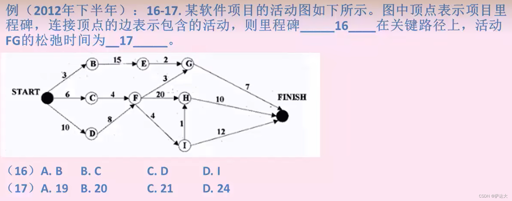
关键路径为图中最长的路径即 D-F-H 权值为48所以第一空选C
FG的松弛时间为 关键路径 - 包含FG的最长路径 （DFH）-（DFG）=48-28=20 所以第二空为B
### 软件项目的组织
程序设计小组的组织方式：
主程序员制小组：主程序员全权负责，后援工程师有必要时能替代主程序员，适合大规模项目。
民主制小组：也即无主程序员小组，成员之间地位平等，任何决策都是全员参与投票，适合于项目规模小，开发人员少，采用新技术和确定性较小的项目。
层次式小组：两个层次，一名组长领导若干个高级程序员，每个高级程序员领导若干个程序员。
### 软件质量管理
| **质量特性** | **质量子特性** |
| --- | --- |
| 功能性 | 适合性 准确性 互用性 依从性 安全性 |
| 可靠性 | 成熟性 容错性 易恢复性 |
| 易使用性 | 易理解性 易学性 易操作性 |
| 效率 | 时间特性 资源特性 |
| 可维护性 | 易分析性 易改变性 稳定性 易测试性 |
| 可移植性 | 适应性 易安装性 一致性 易替换性 |

可维护性（常考）
易分析性：与为诊断缺陷或失效原因，或为判定待修改部分所需那里有关的软件属性。
易改变性：与进行修改、排错、或适应环境变换所需努力有关的软件属性。
稳定性：与修改造成未预料效果风险有关的软件属性。
易测试性：为确认经修改软件所需努力有关的软件属性。
### 软件容错技术
通常将质量理解为用户满意程度，为了使用户满意，有两个必要条件：设计的规格说明书符合用户标准，称为设计质量。程序按照设计规模书所规定的情况正确执行，称为程序质量。
设计质量评审，程序质量评审
软件容错技术：
容错就是软件遇到错误的处理能力，实现容错的手段主要是冗余，包括下面四种冗余技术：
结构冗余：分为静态（通过表决和比较，少数服从多数）、动态（多重模块待机备份，故障是切换备份机）、混合冗余（二者综合）。
信息冗余：为检错和纠错在数据中加上一段额外的信息，例如检验码原理。
时间冗余：遇到错误是重复执行，例如回滚，重复执行还有错，则转入错误处理逻辑。
冗余附加技术：冗余附加技术是指为实现数据结构，信息和时间冗余技术所需的资源和技术，包括程序，指令，数据，存放和调动它们的空间和通道等
### 风险管理
风险管理两个特性：不确定性（可能发生也可能不发生）、损失（发生会产生恶性后果）。
项目风险威胁到项目计划，如果项目风险发生，有可能拖延项目的进度和增加项目的成本，指预算。进度、人员、资源。利益相关者、需求等方面的潜在问题以及它们对软件项目的影响。项目复杂度、规模及结构不确定性也属于项目风险因素。
技术风险威胁到要开发软件的质量和交付时间，如果技术风险发生，开发工作就变得很困难或者不可能，只设计、实现、接口、验证和维护等方面的潜在问题。此外，规格说明的歧义性，技术的不确定性，技术陈旧以及“前沿”技术也是技术风险因数。
商业风险威胁到要开发软件的生存能力，包括下面五种：

1. 市场风险：开发了一个没有人真正需要的优良产品或系统。
2. 策略风险：开发的产品不在符合公司的整体商业策略。
3. 销售风险：开发了一个销售部门不知道该如何销售的产品。
4. 管理风险：由于重点的转移或人员变动而失去了高级管理层的支持。
5. 预算风险：没有得到预算或人员的保证。

风险管理过程如下：

1. 风险识别：识别出项目中已知和可预测的风险，确定风险的来源，产生的条件，描述风险的特征以及哪些项目可以产生风险。形成一个风险列表。
2. 风险预测：又称为风险估计，从两个方面预测风险，即风险可能发生的概率和风险产生的后果，因此有风险曝光度=风险发生的可能性*风险发生带来的损失。
3. 风险评估：定义风险参照水准，将识别出来的风险评估分类。
4. 风险控制：辅助项目组建立处理风险的策略，包括风险避免，风险监控，RMMM计划（风险缓解，监控和管理计划）
### 软件度量
软件的两种属性：外部属性指面向管理者和用户的属性，可直接测量，一般为性能指标。内部属性指软件产品本身的属性，如可靠度等，只能间接测量。
McCabe算法：又称为环路复杂度，假设有向图中有向边数为M，节点数为N，则此有向图的环路复杂度为M-N+2。
## 三 计算机网络和多媒体
### 计算机网络的概念
计算机网络是计算机技术与通信技术相结合的产物，它实现了远程通信，远程信息处理和资源共享。
计算机网络的功能：数据通信，资源共享，负载均衡，高可靠性。
计算机网络的分类：

1. 局域网（LAN）：传输速率 4Mbps~1Gbps
2. 城域网（MAN）：传输速率 50Kbps~100Mbps
3. 广域网（WAN）：传输速率 9.6Kbps~45Mbps
### 网络的拓扑结构
总线型（利用率低，干扰大，价格低）
星型（交换机形成的局域网，中央单元负荷大）
环型（流动方向固定，效率低扩展难）
树型（总线型的扩充 ，分级结构）
分布式（任意节点连接，管理难成本高）

### OSI七层模型
从下往上依次是：物理层，数据链路层，网络层，传输层，会话层，表示层，应用层。

1. 物理层：二进制数据传输，物理链路和物理特性相关。
2. 数据链路层：将数据封装成帧进行传输，准确传送至局域网内的物理主机上。
3. 网络层：数据分组传输和路由选择，能准确的将数据传输到互联网的主机上。
4. 传输层：端到端的链接，传送数据至主机端口上。
5. 会话层：管理主机之间的会话，提供会话管理服务。
6. 表示层：提供解释所交换数据的含义的服务，包括数据之间的格式转换，压缩，加密等操作，对数据进行处理。
7. 应用层：实现具体的应用功能，直接进程间的通信。
#### 网络互联硬件
物理层：中继器（扩大信号），集线器Hub（多路中继器）
数据链路层：网桥（分析帧地址），交换机（多路网桥，MAC地址表）
网络层：路由器（连接多个逻辑上分开的网络，路由选择）
应用层：网关（连接不同类型且协议差别较大的网络，协议转换）
传输介质：
有线介质：双绞线（ 最大长度100m，每端需要一个RJ45插件），同轴电缆，光纤。
无线介质：微波，红外线和激光，卫星通信。
#### 局域网协议
IEEE802.3 :标准以太网 速度为10Mbps，传输介质是同轴电缆。
IEEE802.3u: 快速以太网 速度为100Mbps 传输介质是双绞线。
IEEE802.3z:千兆以太网 速度为1000Mnps 传输介质是光纤或双绞线。
#### TCP/IP协议族
特性：逻辑编址，路由选择，域名解析，错误检测和流量控制。
TCP/IP分层模型

1. 应用层：具体应用功能。
2. 传输层：提供应用程序间端对端的通信。
3. 网际层：又称IP层，处理机器间的通信，数据以分组为单位。
4. 网络接口层：又称数据链路层，负责接收IP数据报，并把数据报通过选定的网络发送出去。
   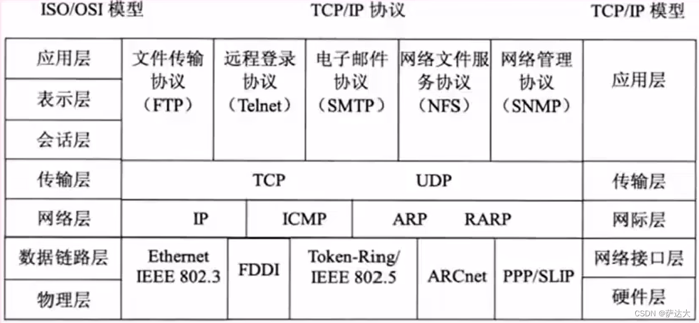
##### 网络层协议
IP协议：最重要最核心的协议（无连接，不可靠）
ICMP协议：因特网控制信息协议，检测网络通信顺畅
ARP协议和RARP协议：地址解析协议和反地址解析协议
ARP   IP地址 -> 物理地址
RARP   物理地址 ->IP地址
##### 传输层协议
== UDP协议：不可靠链接， 一般用于视频，音频传输
TCP协议：可靠连接 （三次握手协议）==
##### 应用层协议
基于TCP的FTP，HTTP都是可靠传输，基于UDP的DHCP，DNS都是不可靠传输。
FTP：文件传输协议（可靠）控制端口为21 传输端口为20
HTTP（默认端口80）：超文本传输协议 （可靠）使用SSL加密后为HTTPS（默认端口443）
SMTP（发送）和POP3（收取）：邮件传输协议（可靠） 邮件报文采用ASCLL格式表示
Telent：远程连接协议（可靠）
TFTP：小文件传输协议（不可靠）
SNMP：简单网络管理协议（不可靠）
DHCP：动态分配IP地址协议（不可靠）客户机/服务器模型 默认租期为8天
DNS：域名解析协议（不可靠）将域名解析成IP地址
### IP地址
分类地址格式：IP地址分为四段，每段八位，共32位二进制数组成。
在逻辑上，这32位IP地址分为网络号和主机号，依据网络号位数不同，可以将IP地址分为一下几类：

1. A类：0.0.0.0~127.255.255.255 （八位网络号，主机号位32-8，能分配的主机号个数为2^24-2个，全0和全1不能分配）
2. B类：128.0.0.0~191.255.255.255（16位网络号）
3. C类：192.0.0.0~223.255.255.255（24位网络号）
4. D类组播：224.0.0.0~239.255.255.255
5. E类保留：240.0.0.0~255.255.255.255
   IPV6地址长度为128位，地址空间增加了2^96倍。
### 防火墙
防火墙是内部网络和外部因特网之间增加的一道安全防护措施，它认为内部网络是安全的，外部网络是不安全的。分为网络级防火墙和应用级防火墙，两级之间的安全手段如下所示：
网络级防火墙（包过滤防火墙）层次低，但是效率高，因为其使用包过滤和状态监测手段，一般只检验网络包外在（起始地址，状态），属性是否异常，若异常，则过滤掉，不与内网通信，因此对用户和应用是透明的。如果遇到伪装的危险数据包就没办法过滤掉。
应用及防火墙（代理服务器防火墙）：层次高，效率低，因为应用级防火墙会将网络包拆开，具体检查里面的数据是否有问题，会消耗大量的时间，造成效率低下，但是安全强度高，包括双宿主主机，屏蔽主机网关被屏蔽子网等方法。
被屏蔽子网方法，是在内网和外网之间增加了一个屏蔽子网，相当于多了一层网络，称为DMZ（非军事区），这样内网和外网通信必须多经过一道防火墙，屏蔽子网中一般存放的是邮件服务器，WEB服务器这些内外网数据交互的服务器，可以屏蔽掉一些来自内部的攻击，但是完全来自系统内部服务器的攻击还是无法屏蔽掉。
### 计算机病毒和木马
病毒：编制或在计算机程序中插入的破坏计算机功能或者破坏数据，影响计算机使用并且能够自我复制的一组计算机指令和或程序代码。病毒具有：传染性，隐蔽性，潜伏性，破坏性，针对性，衍生性，寄生性，未知性。
木马：是一种后门程序，常被黑客用作控制远程计算机的工具，隐藏在被控制电脑上的一个小程序监视电脑一切操作并盗取数据。
病毒和木马的种类
系统引导型病毒
文件外壳型病毒
目录型病毒
蠕虫病毒（感染EXE文件 可执行文件）：熊猫烧香，罗密欧与朱丽叶，恶魔，尼姆达，冲击波
木马：QQ消息尾巴木马，特洛伊木马，冰河。
宏病毒（感染word，Excel等文件）：美丽沙，台湾一号。
CIH病毒：史上唯一破坏硬件的病毒。
红色代码（蠕虫病毒+木马）
### 网络安全
网络安全的五大要素:保密性，完整性，可用性，可控性，不可抵赖性。
#### 网络攻击
重放攻击（ARP）：所截获某次合法的通信数据拷贝，出于非法的目的而被重新发送。
拒绝服务（DOS）：对信息或其他资源的合法访问被无条件阻止。
旁路控制：攻击者利用系统的安全缺陷或安全性上的脆弱之处获得非授权的权利或特权。
授权侵犯：被授权以某一目的使用某一系统或资源的某个人，却将此权限用于其他非授权的目的，也称作“内部攻击”。
特洛伊木马：软件中含有一个察觉不出或者无害的程序段，当它被执行时，会破坏用户的安全。
窃听：用各种可能合法或非法的手段窃取系统中的信息资源或敏感信息。
业务流分析：通过对系统的长时间监听，利用统计分析方法对诸如通信频度，通信的信息流向，通信总量的变化等参数进行研究，从而发现有价值的信息和规律。
信息泄露：信息被泄露或透露给某个未授权的实体。
破坏信息完整性：数据被非授权的 进行增删，修改或破坏而受到损失。
#### 加密技术
基本概念：
明文：实际传输的真正数据。
密文：经过加密后的数据。
加密：将明文转换为密文的过程。
解密：将密文转换为明文的过程。
加密算法：一般是公开的。包括两大规则：代换（转换为完全不同的数据），置换（打乱明文顺序，进行重新置换）
秘钥：加密和解密过程中使用的密码等，是隐藏的。
对称加密技术：对数据加密和解密的秘钥是相同的，也称为共享秘钥加密技术。属于不公开秘钥加密算法。其缺点是加密安全性不高（因为只有一个秘钥）且秘钥分发困难。但是其加密快，适合大数据的加密。
常见的对称加密算法如下：
DES:替换+移位，56位秘钥，64位数据块，速度快，秘钥易产生。
3DES（三重DES或称TDEA）：两个56位秘钥K1,K2
加密：K1加密->K2解密->K1加密
加密：K1解密->K2加密->K1解密
AES:AES算法是基于排序和置换运算。是美国联邦政府采用的一种区块加密标准。
RC-5：RSA数据安全公司的很多产品都使用了RC-5。
IDEA算法：128位秘钥，64位数据块，比DES加密性好，对计算机功能要求相对低。
非对称加密技术：又称公开秘钥加密技术，非对称加密技术的保密性好，它消除了最终用户交换 秘钥的需要，但加密解密花费的时间长，速度慢，不适合对文件加密，而只适合对少量数据进行加密。
公钥体系中，公钥是用于加密和认证，私钥用于解密和签名。
常见的非对称加密算法如下：
RSA：512位或1024位秘钥，计算量极大，难破解。
Elgamal：其基础是Diffie-HEllman秘钥交换算法。
ECC：椭圆曲线算法。
其他非对称算法：背包算法，Rabin，D-H。
### 常见网络诊断命令
ping：用于检查网络是否连通；
tracert( linux: traceroute)：用于确定 IP数据包访问目标所采取的路径，若网络不通，能定位到具体哪个结点不通；
ipconfig（linux: ifconfig）：显示TCP/IP网络配置值，如：IP地址，MAC地址，网关地址等；
nslookup：查询DNS记录；
Netstat：用于显示网络连接、路由表和网络接口信息。
### 多媒体基本概念
媒体可分为下面五类：

1. 感觉媒体：直接作用于人的感官器官，使人产生直接感觉的媒体。如视觉，听觉，触觉等。
2. 表示媒体：指传输感觉媒体的中介媒体，即用于数据交换的编码。如文字，图形，动画，音频，和视频等
3. 表现媒体：进行信息输入和信息输出的媒体。如键盘，鼠标和麦克风；显示器，打印机和音响等，
4. 存储媒体：存储表示媒体的物理介质，如磁盘，光盘和内存等
5. 传输媒体：传输表示媒体的物理介质，如电缆，光纤，双绞线等

声音 人耳能听到的音频信号的频率范围是20Hz~20KHz。
声音的采样频率一般为最高频率的两倍，才能保证不失真
声音文件格式：.wav 、.snd 、.au 、.aif 、.voc 、.mp3 、.ra 、.mid等
### 图形和图像
颜色三要素：
亮度：彩色明暗深浅程度。
色调（红，绿）：颜色的类别。
饱和度：某一颜色的深浅程度。
图像的属性：分辨率（每英寸像素点dpi），像素深度（存储每个像素所使用的的二进制位数）
图像文件格式：.bmp、.gif 、.png 、.jpg、.tif、.wmf等
图像深度是图像文件记录一个像素点所需要的的位数，显示深度表示显示缓存中记录屏幕上一个点的位数（bit），也即显示器可以显示的颜色数
水平分辨率：显示器在横向上具有的像素点数目。
垂直分辨率：显示器在纵向上具有的像素点数目。
矢量图的基本组成单位是图元，位图的基本组成单位是像素，视频和动画的基本组成单位是帧。
### 多媒体计算
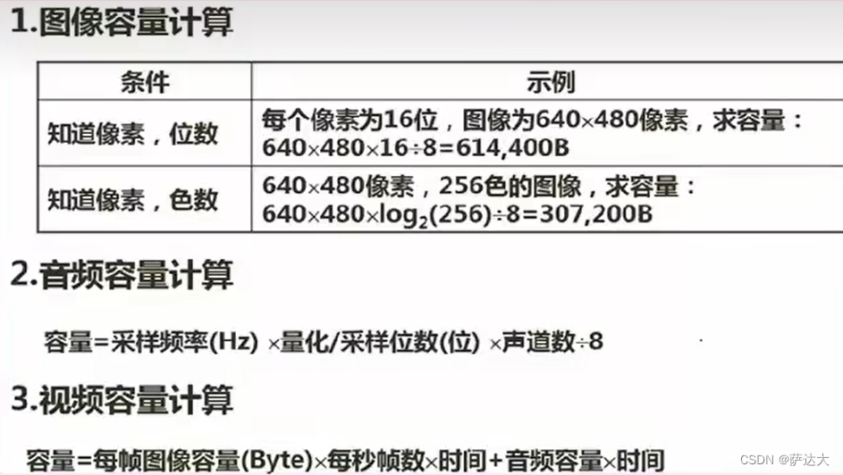
## 四 操作系统
### 进程的组成和状态
进程的组成：进程控制块PCB（唯一标志），程序（描述程序要干什么），数据（存放进程执行是所需数据）。
三态图和五态图
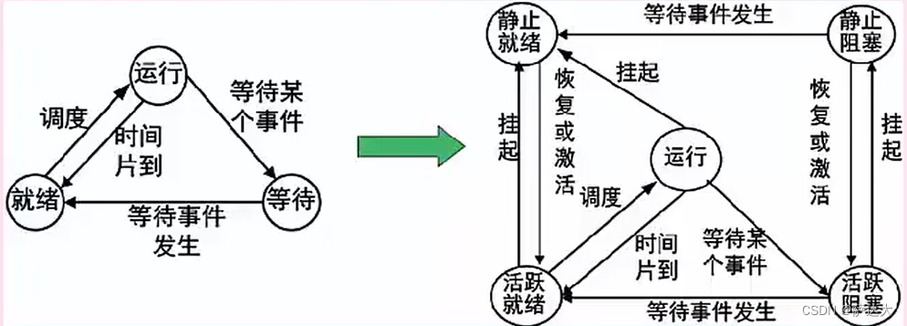
系统自动控制时只有三种状态，人为操作才有五种状态
### 前趋图
前趋图：用来表示哪些任务可以并行执行，哪些任务之间有顺序关系。如下图：
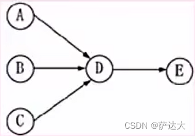
如图可知，A,B,C可以并行执行，而D要等A,B,C执行完了才能执行。
### 进程资源图
进程资源图：用来表示进程和资源之间的分配和请求关系。如下图所示:

P代表进程，R代表资源，R方框中 有几个圆球就表示有几个这种资源，在图中，R1指向P1，表示R1已经分配了一个资源给P1了，P1指向R2，表示P1还需要一个R2才能执行。
阻塞节点：某进程中所请求的资源已全部分配完毕，无法获取所需资源，则该进程被阻塞了无法继续执行，如上图P2。
非阻塞节点：某进程所请求的资源还有剩余，可以分配给该进程继续运行。如上图中P1,P3。
当一个进程资源图中所有进程都是阻塞节点时，即进入死锁状态。
### 死锁
当一个进程在等待永远不可能发生的事件时，就会产生死锁，若系统中多个进程出于死锁状态，就会造成系统死锁。
死锁产生的必要条件：

1. 资源互斥
2. 每个进程占有资源并等待其他资源
3. 系统不能剥夺进程资源
4. 进程资源图是一个环路

死锁产生后，解决措施是打破四大条件，有下列方法：
死锁预防：采用某种策略限制并发进程对于资源的请求，破坏死锁的四大条件之一，使系统任何时候都不满足死锁的条件。
死锁避免：一般采用银行家算法来避免。银行家算法，就是提前计算出一条不会死锁的资源分配方法，才分配资源，否则不分配资源。
死锁检测：允许死锁产生，当系统定时运行一个检测死锁的程序，若检测到系统中发生死锁，则设法加以解除。
死锁解除：即死锁发生后的解除办法，如剥夺资源，撤销进程等。
死锁计算问题：系统内有你n个进，每个进程需要R个资源，那么其发生死锁的最大资源数为n∗(R−1)n*(R-1)n∗(R−1)。其不发生死锁的最小资源数为n∗(R−1)+1n*(R-1)+1n∗(R−1)+1.
### 线程
传统的线程有两个属性：可拥有资源的独立单位，可独立调度和分配的基本单位。
引入线程后，线程是独立调度的最小单位，进程是拥有资源的最小单元。线程可以共享进程的公共数据，全局变量，代码，文件等资源，但不能共享线程独有的资源，如线程的栈指针等标识数据。
## 五 数据库技术基础
### 基本概念
数据库系统DBS：是一个采用了数据库技术，有组织地，动态地存储大量相关数据，方便多用户访问的计算机系统。其由以下四个部分组成：
数据库（统一管理，长期存储在计算机内的，有组织的相关数据集合）
硬件（构成计算机系统的各种物理设备，包括存储数据所需的外部设备）
软件（操作系统，数据库管理系统及应用程序）
人员（系统分析和数据库设计人员，应用程序员，最终用户，数据库管理员DBA ）
### 三级模式-两级映象
内模式：内模式也称存储模式，是数据物理结构和存储方式的描述，是数据在数据库内部的表示方法（存储文件），定义所有的内部记录类型，索引和文件的组织方式。
概念模式：概念模式也称模式，就是我们通常使用的基本表，根据应用，需求将物理数据划分一张张表。
外模式：对应数据库中视图这个级别，将表进行一定处理后在提供给用户使用。
模式/内模式映象：存在于概念级和内部级之间，实现了概念模式和内模式之间的相互转换。
外模式/模式映象：存在于外部级和概念级之间，实现了外模式和概念模式之间的相互转换。
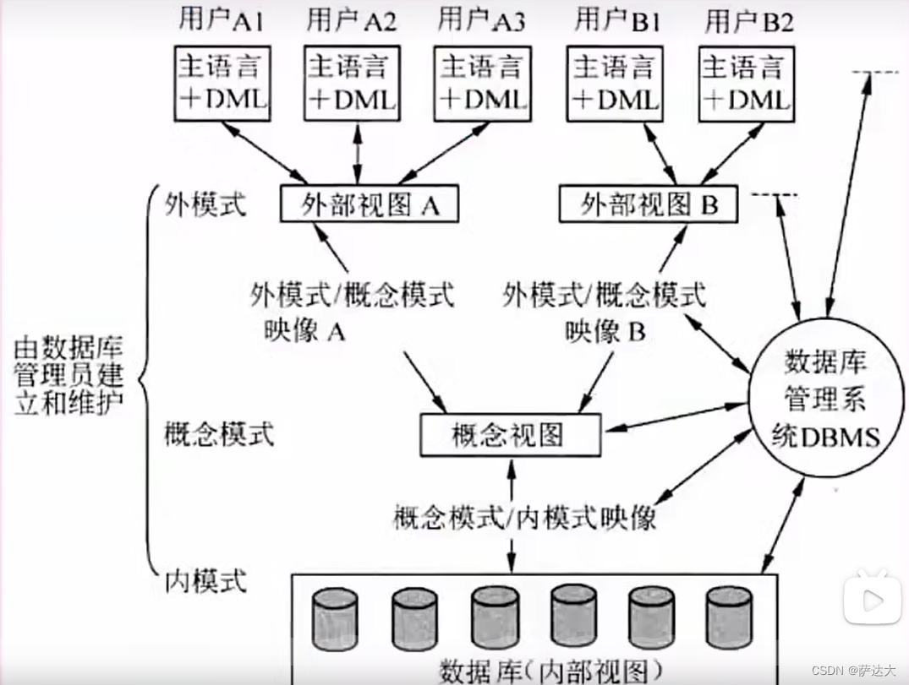
### 数据库设计
需求分析：即分析数据存储的要求，主要产出物有数据流图，数据字典，需求说明书。
概念结构设计：就是设计E-R图，即实体-属性图，与物理实现无关，说明有哪些实体，哪些属性，
逻辑结构设计：将E-R图转成关系模式，即转换为实际的表和表中的列属性。
物理设计：根据生成的表等概念，生成物理数据库。
### E-R模型
E-R模型：即实体-联系模型，使用椭圆表示属性（一般没有），长方形表示实体。菱形表示联系，联系两端要标注联系类型。
联系类型：一对一1:1，一对多1：N，多对多N:M。
属性分类：简单属性和复合属性（属性是否可以分割），单值属性和多值属性（属性是否有多个取值），NULL属性（无意义），派生属性（可由其他属性得来）。
### 关系模型
关系模型即数据库中常用的表，包括实体的属性，标识出实体的主键和外键。实例如下：

E-R图转换为关系模式：每个实体都对应这种关系模式，联系分为三种：
1:1关系中，联系可以放在任意两端的实体中，作为一个属性（要保证1:1的两端要关联）。
1:N关系中，联系可以单独作为一个关系模式，也可以在N端中加入1端实体的主键。
N:M关系中，联系必须作为一个单独的关系模式，其主键是N和M端的联合主键。
### 关系代数运算
并∪：结果是两张表所有记录的合并，相同记录只显示一次。
交∩：结果是两张表中相同的记录。
差-：S1-S2，结果是S1表中有而S2表中没有的记录。

笛卡尔积(×):S1×S2，产生的结果包括S1和S2的所有属性列，并且S1中的每条记录依次和S2中所有记录组合成一条记录，最终属性列为S1+S2属性列，记录数为S1*S2记录数。
投影(π)：实际是按条件选择某关系模式中的某列，列也可以用数字表示。
选择(σ)：实际是按条件选择某关系模式中的某条记录。
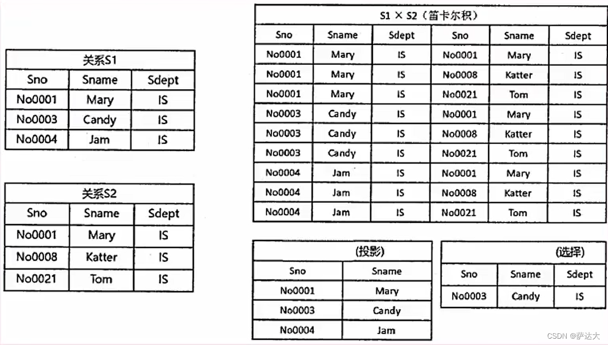
自然连接：自然连接的结果是显示全部的属性列，但相同的属性列只显示一次，显示两个关系模式中属性相同且值相同的记录。

### 函数依赖
给定一个X，能唯一确定一个Y，就称X确定Y，或者说Y依赖于X。
函数依赖又可以扩展一下两种规则：
部分函数依赖：A可以确定C，（A,B）也可以确定C。（A,B）中的一部分（即A）可以确定C，称为部分函数依赖。
传递函数依赖：当A和B不等价时，A可确定B，B可确定C，则A可以确定C，是传递函数依赖。
### 键与约束
超键：能唯一标识此表的属性的组合。
候选键：超键中去掉冗余的属性，剩余的属性就是候选键。
主键：任选一个候选键，即可作为主键。
外键：其他表中的主键。
主属性：候选键内的属性为主属性，其他属性为非主属性。
实体完整性约束：即主键约束，即主键不能为空，也不能为空。
参照完整性约束：即外键约束，外键必须是其他表中已经存在的主键的值，或者为空。
用户自定义完整性约束：自定义表达式约束，如年龄限制在0~150。
### 范式
第一范式1NF：若关系模式R的没一个分量是不可再分的数据项，则关系模式R∈1NF。
第二范式2NF：若关系模式R∈1NF，且每一个非主属性完全依赖主键（不存在部分函数依赖）时，则关系模式R∈2FN。
第三范式3NF：若关系模式R∈2FN，且R中没有非主属性传递依赖于候选键时，则关系模式∈3NF。一般解决方式是拆分传递依赖的非主属性为一个新的关系模式。本质就是主键要直接决定所有非主属性，不能通过非主属性间接决定。
BC范式BCNF：不存在函数依赖，也不存在传递依赖。
### 事务管理
事务：由一系列操作组成，这些操作“要么都做，要么什么都不做”，拥有四种特性，如下
原子性（操作）：要么全做，要么全不做。
一致性（数据）：事务发生后数据是一致的。
隔离性（执行）：任一事务的更新操作直到其成功提交的整个过程对其他事务都是不可见的，不同事务之间是隔离的，互不干涉。
持续性（改变）：事务操作的结果是持续性的。
事务开始begin transaction，事务提交commit ，事务回滚rollback。
### 并发控制
所谓并发控制，是指在多用户共享的系统中许多用户可能同时对同一数据进行操作。并发操作带来的问题是数据的不一致性，主要有三类：丢失更新，不可重复读，读脏数据。
#### 并发控制技术
并发控制的主要技术是封锁，基本封锁的类型有排他锁（简称X锁或者写锁）和共享锁（简称S锁或者读锁）。
排它锁：若事务T对数据对象A加上X锁，则只允许T读取和修改A，其他事务都不能再对A加任何类型的锁，直达T释放A上的锁。
共享锁：若事务T对数据对象A加上S锁，则只允许T读取A，但不能修改A，其他事务只能在对A加S锁，直到T释放A上的S锁。这就保证了其他事务可以读A，但在T释放A上的S锁之前不能对A进行任何修改。
#### 三级封锁协议
一级封锁协议：事务在修改数据R前必须对其加X锁，直到事务结束才释放。一级封锁协议可以解决丢失更新问题
二级封锁协议：在一级封锁协议的基础上，加上事务T在读数据R前必须先对其加S锁，读完后立即释放S锁。二级封锁协议可以解决读脏数据的问题
三级封锁协议：在一级封锁协议的基础上，加上事务T在读数据R前必须先对其加S锁，直到事务结束时释放S锁。三级封锁协议除了防止修改和不读“脏”数据外，还进一步防止了不可重复读。
### 分布式数据库
局部数据库位于不同的物理位置，使用一个全局的DBMS将所有局部数据库联网管理，这就是分布式数据库。其体系结构如下图所示：
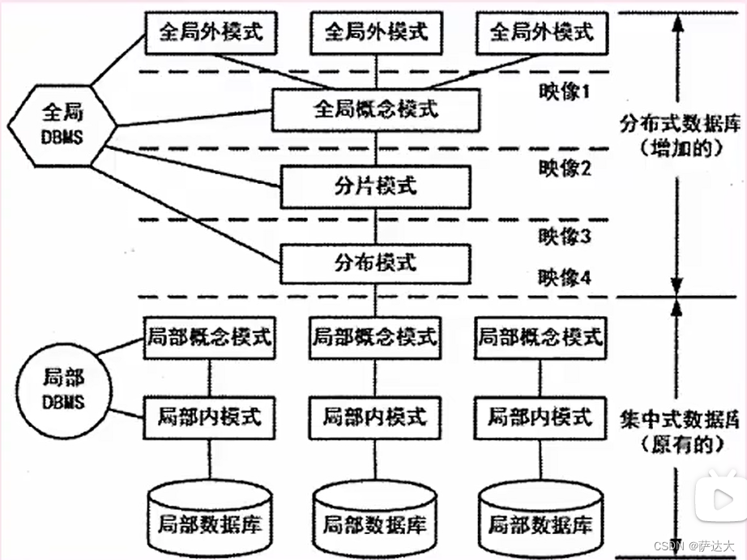
分片模式
水平分片：将表中水平的记录分别存在不同的地方。
垂直分片：将表中的垂直的列值分别存在不同的地方。
分布式透明性
分片透明性，用户或应用程序不需要知道 逻辑上存储的表具体是如何分块存储的。
位置透明性：应用程序不关心数据存储物理位置的改变。
逻辑透明性：用户或应用程序无需知道局部使用的是哪种数据结构。
复制透明性：用户或应用程序不关心复制的数据从何而来。
### 数据仓库
数据仓库是一种特殊的数据库，也是按数据库形式存储数据，但是目的不同，数据库经过长时间的运行，里面的数据会越存越多，就会影响数据库的运行效率，对于某些程序而言，很久之前的数据并非必要的，因此，可以删除掉减少数据，增加效率，考虑到删除这些数据比较可惜，因此，一般将这些数据库提取出来保存到另一个数据库中，称为数据仓库。
数据仓库的目的不是为了应用，是面向主题的，用来做数据分析，集成不同表，而且是相对稳定的，一般不会做修改，同时会在特定的时间点做大量的插入，反应历史的变化。
形成数据仓库后，有两个作用，一个是用来做数据的查询、分析、生成报表，另一个是使用数据挖掘工具对这些历史数据进行挖掘，查询数据之间的关系，发现剩余价值。
数据挖掘的分析方法
关联分析：关联分析主要用于发现不同事物之间的关联性，即一个事物发生的同时，另一个事物也经常发生。
序列分析：序列分析主要用于发现一定时间间隔内接连发生的事件，这些事件构成一个序列，发现的序列应该具有普遍意义。
分类分析：分类分析通过分析具有类别的样本特点，得到决定样本属于各种类别的规则或方法。分类分析时首先为每个记录赋予一个标记，即按标记分类记录，然后检查这些标定的记录，描述出这些记录的特征。
聚类分析：聚类分析师根据“物以类聚”的原理，将本身没有类别的样本聚集成不同的组，并且对每个这样的组进行描述的过程。
### 反规范化技术
规划化操作可以防止插入异常，更新，删除异常和数据冗余，一般是通过模式分解，将表拆分，来达到这个目的。
但是表拆分后，解决了上述异常，却不利于查询，每次查询时，可能都要关联很多表，严重降低了查询效率，因此，有时候需要反规划技术来提高查询效率。
技术手段包括：增加派生性冗余列，增加冗余列，重新组表，分割表。
主要就是增加冗余，提高查询效率，为规划化操作的逆操作。
### SQL语句
增 create 删 delete 改 update 查 select
数据库查询select…（属性）…from…（表名）…where （条件）
分组查询group by 分组是要注意select后的列名要适应分组，having为分组附加条件:select sno,avg from student group by sno having(avg>60)
更名运算 as: select sno as “学号” from t1
字符串匹配 like，%匹配多个字符，_匹配任意一个字符
排序 order by：默认为升序，降序要加关键字desc：select * from order by sno desc。
## 六 程序设计语言基础知识
程序设计语言是为了书写计算机程序而人为设计的符号语言，用于对计算过程进行描述、组织和推导。
低级语言：机器语言（计算机硬件只能识别0,1的指令序列），汇编语言。
高级语言：功能更强，抽象级别更高，与人们使用的自然语言比较接近。
各程序语言的设计特点：

1. Fortran语言（科学计算，执行效率高）
2. Pascal语言（为教学而开发的，表达能力强，Delphi）
3. C语言（指针操作能力强，高效）
4. Lisp语言（函数式程序语言，符号处理，人工智能）
5. C++语言（面向对象，高效）
6. Java语言（面向对象，中间代码，跨平台）
7. C#语言（面向对象，中间代码，.net）
8. Prolog语言（逻辑推理，简洁性，表达能力，数据库和专家系统）

解释与编译：都是将高级语言翻译成计算机硬件认可的机器语言加以执行，不同之处在于编译程序生成独立的可执行文件，直接运行，运行时无法控制源程序，效率高。而解释程序不生成可执行文件，可以逐条解释执行，用于调试模式，可以控制源程序，因为还需要控制程序，因此执行速度慢，效率低。
程序设计语言组成：语法（一组规则），语义（语法成分的含义），语用（构成语言的各个标记和使用者的关系）。
### 程序设计语言的基本成分
数据成分：指一种程序设计语言数据和数据类型，数据分为常量（程序运行时不可改变），变量（程序运行可以改变），全局变量（存储空间在静态数据区分配），局部变量（存储空间在堆栈区分配）。数据类型有整型，字符型，双精度浮点型，单精度浮点型，布尔型等。
运算成分：指明允许使用的运算符号及运算规则。包括算术运算，逻辑运算，关系运算，位运算等。
控制成分：指明语言允许表述的控制结构。包括顺序结构，选择结构，循环结构，
传输成分：指明语言允许的数据传输方式。如赋值处理，数据的输入输出等。
### 函数
函数：C程序有一个或多个函数组成，每个函数都有一个名字，其中有且仅有一个的main函数作为程序的入口。函数式程序模块的主要成分，是一段具有独立功能的程序。函数涉及三个概念：函数定义，函数声明，函数调用。
传值调用：将实参的值传递给形参，形参的改变不会导致调用点所传实参的值改变。实参可以是变量，常量和表达式。
传址调用：即引用调用，将实参的地址传递给形参，即相当于实参存储单元的地址引用，因此其值改变的同时就改变的实参的值。实参的值不能为常量，只能是合法的变量或表达式。
### 编译程序基本原理
编译程序的功能是把某高级语言书写的源程序翻译成与之等价的目标程序（汇编语言和机器语言）。编译程序工作过程分为6个阶段，如下图所示：

词法分析：这个阶段的任务是从左到右一个一个字符地读入源程序，即対构成源程序的字符流进行扫描然后根据构词规则识别单词（也称单词符号或符号）
语法分析：是编译过程的一个逻辑阶段。语法分析的任务是在词法分析的基础上将单词序列组合成各类语法短语，如“程序”、“语句”、“表达式”等等，语法分析程序判断源程序在结构上是否正确。
语义分析：是编译过程的一个逻辑阶段，语义分析的任务是对结构上正确的源程序进行上下文有关性质的审查。如类型匹配、除法除数不为0等。有分为静态语义错误（在编译阶段能够查找出来）和动态语义错误（只能在运行时发现）
中间代码和目标代码生成：中间代码是根据语义分析产生的，需要经过优化链接，最终生成可执行的目标代码。引入中间代码的目的是进行与机器无关的代码优化处理，常用的中间代码有后缀式（逆波兰式）、三元式（三地址码）、四元式、图和树等形式。
### 编译程序基本原理

主要掌握上述三种表达式即可，其实就是树的三种遍历，一般正常的表达式是中序遍历，即中缀表达式，根据其构造出树，再按题目要求求出前缀或后缀式。
简单求法：后缀表达式是从左往右开始，先把表达式加上括号，再依次把运算符加到本层次的括号后面。

### 文法定义

终结符：最终结果，不能推导出其他元素。
非终结符：能够推导出其他元素。
产生式：即非终结符推导出终结符的公式。
闭包：概念如下图。一般考察闭包可以为0个的情况代入运算：

### 正规式
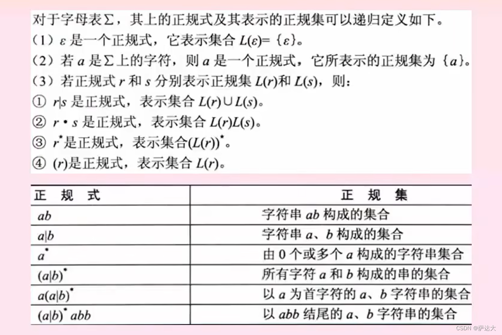
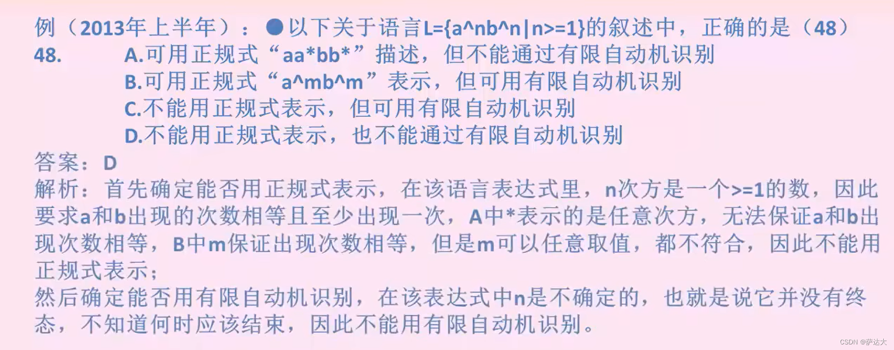
### 有限自动机
确定的有限自动机和不确定的有限自动机：输入一个字符，看是否能得到唯一的后继，若能，则是确定的，否则若得出多个后继，则是不确定的。
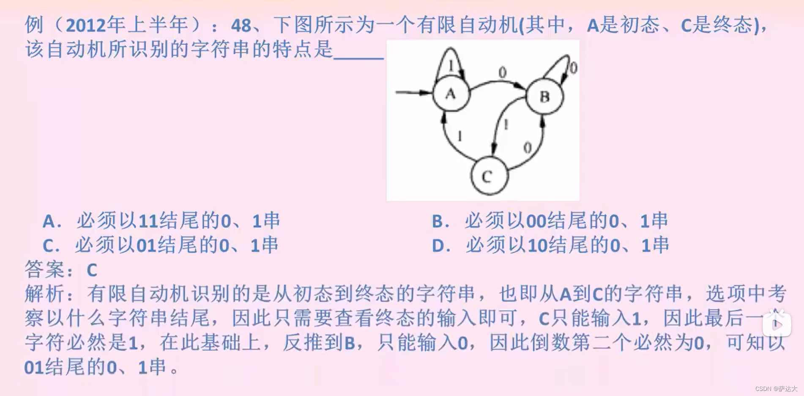
## 七 系统开发与运行
### 系统分析概述
系统分析是一种问题的求解技术，它将一个系统分解成各个组成部分，目的是研究各个部分如何工作，交互，以实现其系统目标。
目的和任务：系统分析的主要任务是对现行系统进一步详细调查，将调查中所得到的文档资料集中，对组织内部整体管理状况和信息处理过程进行分析，为系统开发提供所需资料，并提交系统方案说明书。
系统分析的主要步骤

1. 认识、理解当前的现实环境，获得当前系统的“物理模型”。
2. 从当前系统的“物理模型”抽象出当前系统的“逻辑模型”。
3. 对当前系统的“逻辑模型”进行分析和优化，建立目标系统的“逻辑模型”。
4. 对目标系统的逻辑模型具体化（物理化），建立目标系统的物理模型。

系统开发的目的是将现有系统的物理模型转换为目标系统的物理模型。
### 系统设计
系统设计基本原理：
抽象（重点说明本质问题，忽略非本质方面）
模块化（可组合、分解和更换的单元）
信息隐蔽（将每个程序的成分隐蔽或封装在一个单一的设计模块中）
模块独立（每个模块完成一个相对独立的特定子功能，且与其他模块之间的联系简单）
模块的设计要求独立性高，就必须高内聚，低耦合，内聚是指一个模块内部功能之间的相关性，耦合是指多个模块之间的联系。
### 内聚
内聚程度从低到高如下表所示：

| **内聚分类** | **定义** | **记忆关键字** |
| --- | --- | --- |
| 偶然内聚 | 一个模块内各处理元素之间没有任何联系 | 无直接关系 |
| 逻辑内聚 | 模块内执行若干个逻辑上相似的功能，通过参数确定改模块完成哪一个功能 | 逻辑相似，参数决定 |
| 时间内聚 | 把需要同时执行的动作组合在一起形成模块 | 同时执行 |
| 过程内聚 | 一个模块完成多个任务，这些任务必须按指定的过程执行 | 指定的过程顺序 |
| 通信内聚 | 模块内所有处理元素都在同一个数据结构上操作，或者各处理使用相同的输入数据或产生相同的输出数据 | 相同的数据结构、形同的输入输出 |
| 顺序内聚 | 一个模块中各个处理元素都密切相关于同一功能且必须顺序执行，前一个功能元素的输出就是后一个功能元素的输入 | 顺序执行、输入为输出 |
| 功能内聚 | 最强的内聚，模块内所有元素共同作用完成一个功能，缺一不可 | 共同作用，缺一不可 |

### 耦合
耦合程度从低到高如下表所示：

| **耦合分类** | **定义** | **记忆关键字** |
| --- | --- | --- |
| 无直接耦合 | 两个模块之间没有直接的关系，它们分别从属于不同模块的控制与调用，不传递任何信息 | 无直接关系 |
| 数据耦合 | 两个模块之间有调用关系，传递的是简单的数据值，相当于高级语言中的值传递 | 传递数据值调用 |
| 标记耦合 | 两个模块之间传递的是数据结构 | 传递数据结构 |
| 控制耦合 | 一个模块调用另一个模块时，传递的是控制变量，被调用模块通过该控制变量的值，有选择的执行模块内的某一功能 | 控制变量，选择执行某一功能 |
| 外部耦合 | 模块间通过软件之外的环境联合（如I/O将模块耦合到特定的设备，格式，通信协议）时 | 软件外部环境 |
| 公共耦合 | 通过一个公共数据环境相互作用的那些模块间的耦合 | 公共数据结构 |
| 内容耦合 | 当一个模块直接使用另一个模块的内部数据，或通过非正常入口转入另一个内部模块时 | 模块内部关联 |

### 系统设计
系统设计的主要目的是系统制定蓝图，在各种技术和实施方法中权衡利弊，精心设计，合理的使用各种资源，得出新系统的详细设计方案。
步骤：概要设计和详细设计
概要设计基本任务：设计软件系统总体结构，数据结构及数据库设计，编写概要设计文档，评审。
详细设计基本任务：模块内详细算法设计、模块内数据结构设计，数据库物理设计、其他设计（代码，输入输出格式，用户界面），编写详细设计文档，评审。
### 软件需求
按需求内容分类：
业务需求:由客户提出的宏观的一个功能需求。
用户需求：设计员去调查需求中涉及的每个用户的具体需求。
系统需求：经过整合，形成最终的系统需求，包括功能，性能，设计约束三个方面的需求。
从客户角度分类：
基本需求：需求明确规定的功能。
期望需求：除了基本需求外，客户认为理所应当包含在内的其他功能。
兴奋需求：客户未要求其他功能需求，会浪费项目开发时间和成本。
软件需求分类：
功能需求：软件必须完成的基本动作。
性能需求：说明软件或人与软件交互的静态或动态数值需求。如系统响应速度，处理速度等。
设计约束：受其他硬件标准限制等方面影响。
属性：可用性、安全性、可维护性，可移植性。
外部接口需求：用户接口，硬件接口，软件接口，通信接口。
### 测试基础知识
系统测试是为了发现错误而执行程序的过程，成功的测试是发现了至今尚未发现的错误的测试。
测试原则：
应尽早并不断的进行测试。
测试工作应该避免由开发软件的人或小组承担。
在设计测试方案时，不仅要确定输入数据，而且要根据系统功能确定预期的输出结果。
即包含有效、合理的测试用例，也包含不合理、失效的用例。
检验程序是否做了该做的事，且是否做了不该做的事。
严格按照测试计划执行。
妥善保存测试用例和测试计划。
测试用例可以重复使用或追加测试。
### 测试阶段
单元测试：对单个模块进行测试，由程序员自己测试模块内部的接口、信息、功能，测试依据是软件详细说明书。在单元测试中，驱动模块（上层）用来调用被测模块，自顶向下的单元测试中不需要另外编写驱动模块，桩模块（底层）用来模拟被测模块所调用的子模块。
集成测试：将模块组合起来进行测试，分为一次性组装（简单，节约时间，发现错误少，只适合小项目）和增量式组装（能够发现更多错误，耗时长，又可分为：自顶向下，自底向上，混合式）。
确认测试：对已完成的软件进行功能上的测试，分为内部确认测试（无用户情况）、Alpha测试（用户在开发环境下测试），Beat测试（用户在实际使用时进行的测试）、验收测试（用户根据SRS对项目进行验收）。
系统测试：对软甲进行性能测试，主要分为三个方面，即负载测试（在极限情况下，系统各项性能指标）、强度测试（系统资源特别低的情况下），容量测试（并发测试，系统可以处理的同时在线的最大用户数）。其他还有可靠性等性能测试，系统测试一般使用黑盒测试方法。
回归测试：软件修改错误或者变更后，进行回归测试以验证之前正确的代码是否引入了错误。
动态测试：程序运行时测试，分为：
黑盒测试法：功能性测试，不了解软件代码结构，根据功能设计用例，测试软件功能。
白盒测试法：结构性测试，明确代码流程，根据代码逻辑设计用例，进行用例覆盖。
灰盒测试法：即既有黑盒测试，也有白盒测试。
静态测试：程序静止时测试，即対代码进行人工审查，分为：
桌前检查：程序员检查自己编写的程序，在程序编译后，单元测试前。
代码审查：由若干个程序员和测试人员组成评审小组，通过召开程序评审会来进行审查。
代码走查：也是采用开会来对代码进行审查，但并非简单的审查代码，而是由测试人员提供用例，让程序员扮演计算机的角色，手动运行测试用例，检查代码逻辑。
### 测试策略
自底向上：从最底层模块开始测试，需要编写驱动程序，而后开始逐一合并模块，最终完成整个系统的测试。优点是较早的验证了底层模块。
自顶向下：先测试整个系统，需要编写桩程序，而后逐步向下直至最后测试最低层模块。优点是较早的验证了系统的主要控制和判断点。
三明治：既有自底向上也有自顶向下的测试方法，二者都包括。兼有二者的优点，缺点是测试工作量大。
### 测试用例设计
黑盒测试用例：将程序看做一个黑盒子，只知道输入输出，不知道内部代码，由此设计出测试用例，分为下面几类：
等价类划分：把所有的数据按照某种特性进行归类，而后在每类的数据里选取一个即可。等价类测试用例的设计原则：设计一个新的测试用例，使其尽可能多的覆盖尚未被覆盖的有效等价类，重复这一步，直到所有的有效等价类都被覆盖为止；设计一个新的测试用例，使其覆盖一个尚未被覆盖的无效等价类，重复这一步，直到所有的无效等价类被覆盖为止。
边界值划分：将每类的边界值作为测试用例，边界值一般为范围的两断值以及在此范围之外的与此范围间隔最小的两个值，如年龄范围0-150，边界值为0,150，1,151四个。
白盒测试用例：知道程序的代码逻辑，按照程序的代码语句，来设计覆盖代码分支的测试用例，覆盖级别从低至高分为下面六种：
1.语句覆盖：逻辑代码中所有的语句都要执行一遍，覆盖层级最低，因为执行了所有语句，不代表执行了所有条件判断。
2. 判定覆盖：逻辑代码中所有判断语句的条件的真假分支都要覆盖一次。
3. 条件覆盖：对于代码中的一个条件，可能是组合的，如a>0&&b<0，判断覆盖只针对此组合条件的真假分支做两个测试用例，而条件覆盖是对每个独立的条件都要做真假分支的测试用例，共可有4个测试用例，层级更高，注意区别，条件覆盖，针对每个条件都要真假覆盖，判定覆盖，只针对一个条件判断语句。
4. 判定/条件覆盖：使判定中每个条件的所有可能取值（真/假）至少出现一次，并且每个判定本身的判定结果（真/假）也至少出现一次，即两种覆盖的综合。
5. 条件组合覆盖：每个判定条件中条件的各个可能值的组合都至少出现一次。
   6. 路径覆盖：逻辑代码中所有可行路径都覆盖了，覆盖层级最高。
## 八 标准化知识产权
### 保护期限
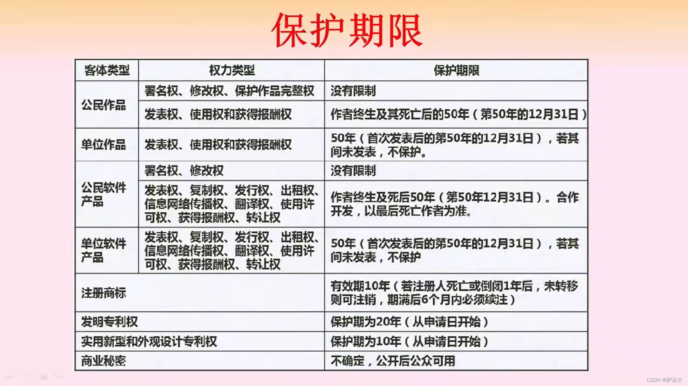
### 单位和个人的著作权归属

### 单位和委托的区别
当合同中未规定著作权的归属时，著作权默认归于单位，而在委托创作中，著作权默认归属创作方个人，具体如下：

### 侵权判定
中国公民、法人、或其他组织的作品，无论是否发表，都享有著作权。
开发软件所用的思想、处理过程、操作方法或者数学概念不受保护。
著作权法不适用下列情形：
法律、法规、国家机关的决议、决定、命令和其他具有立法、行政、司法性质的文件及官方正式译文。
时事新闻。
立法，通用数表，通用表格和公式。
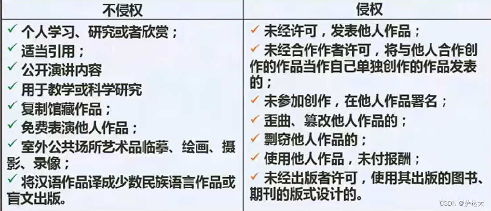
### 其他法律细则
####  商业秘密
构成条件：未公开，能权利人带来利益，保密性。
商业秘密无固定保密时间，一般由企业自行决定。且不能延长。
####  专利权
期限：发明专利权保护期限为自申请日起20年，实用新型专利权和外观设计专利权保护期限为申请日起10年。
专利权谁先申请就归谁，若同一天申请，则双方协商或者以抽签的方式决定。
####  商标权
必须使用注册商标的商品范围包括：国家规定并由国家工商行政管理局公布的人用药物和烟草制品、国家规定并由国家工商行政管理局公布的其他作品。
商标权认定方式与专利权类似，也是谁先申请就归谁，如果同一天申请，则谁先使用归谁，若都未使用或同时使用，则由双方协商或者一抽签的方式决定。
“近似商标”是指文字、数字、图形、三维标志或者颜色组合等商标的构成要素的发音、视觉、含义或排列顺序及整体结构上虽有一定区别，但又使人难以区分，容易产生混淆的商标。会产生商标侵权，故不能同时注册，由双方协商决定，若协商未果后采用抽签决定。
####  引用资料j
只能引用发表的作品，不能引用未发表的作品；只能限于介绍、评论作品，只要不构成自己作品的主要成分，可适当引用资料，不必征得原作者的同意，不需要向他支付报酬。

